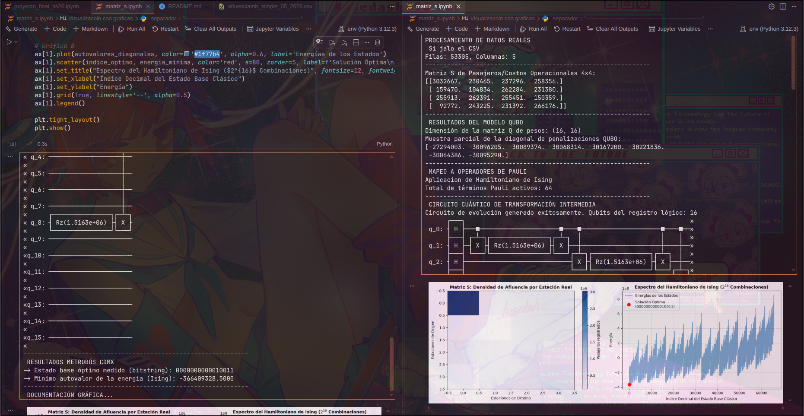

# Proyecto QUBO-QAOA: matching bipartito 4x4

`Ramirez Alvarado David Jezhuah`

# Dataset

`Nombre del dataset:`

Afluencia diaria de metrobus CDMX

`Fuente oficial o confiable:`

Organismo Público de Transporte / Portal de Datos Abiertos de la CDMX

`Institución responsable:`

Secretaria de Movilidad (SEMOVI)

`URL de la fuente:`

https://datos.cdmx.gob.mx/dataset/afluencia-diaria-de-metrobus-cdmx

`URL raw del CSV usado en data/:`

https://datos.cdmx.gob.mx/dataset/afluencia-diaria-de-metrobus-cdmx/resource/f7943c47-835d-4078-93ea-906f64b72f3b

`Licencia o condiciones de uso:`

Licencia GPL (Datos Abiertos de la CDMX)

`Fecha de consulta:`

22 de junio 2026

`Dominio del problema:`

El problema consiste en la optimización del flujo y balanceo de carga en el sistema de transporte masivo de la Ciudad de México (Metrobús). Durante las horas pico, estaciones de transferencia masiva (orígenes) colapsan debido a la saturación. El objetivo es asignar estratégicamente el flujo de pasajeros de estos orígenes hacia líneas de descompresión operativas (destinos) para equilibrar el sistema y minimizar el tiempo de espera global, modelando esto como un problema de emparejamiento bipartito óptimo uno a uno.

## Modelado

### Conjunto A:

`Estaciones críticas de origen/interconexión con mayor saturación y flujo de pasajeros en la Ciudad de México:`

Pantitlán (Punto de transferencia masiva este)

Indios Verdes (Terminal multimodal norte)

El Rosario (Nodo de interconexión noroeste)

Buenavista (Conexión centro con Tren Suburbano)

`Criterio para elegir exactamente 4 elementos de A:`

Se seleccionaron los 4 nodos terminales e interconexiones que históricamente concentran más del 60% de los transbordos caóticos y flujos de entrada en horas pico según los registros de SEMOVI.

### Conjunto B:

`Líneas operativas de descompresión/destinos recomendados del Metrobús para balancear la carga:`

Línea 1 (Insurgentes)

Línea 2 (Eje 4 Sur)

Línea 3 (Eje 1 Poniente)

Línea 4 (Ruta Centro - Aeropuerto)

`Criterio para elegir exactamente 4 elementos de B:`

Se seleccionaron las 4 líneas principales que conectan de forma directa o indirecta con los nodos de origen y que cuentan con la infraestructura necesaria para absorber la redistribución de pasajeros.

Definición de $x_{ij} = 1$:

Indica que el nodo de origen $i$ se asigna prioritariamente a la línea de destino $j$ para canalizar su demanda de pasajeros.

Interpretación de $x_{ij} = 0$:

Indica que no hay una asignación preferencial directa entre el nodo de origen $i$ y la línea de destino $j$ en este intervalo de tiempo operativo.

## Matriz de score

`Columnas usadas:`

afluencia (filtrada y promediada por estación y línea para el periodo reciente, eliminando columnas ruidosas como la fecha descriptiva o anio para evitar desajustes dimensionales).

Fórmula exacta de $S_{ij}$:

$$S_{ij} = \text{Afluencia promedio de la estación } i \text{ canalizada hacia la línea } j$$

Buscamos un costo operacional mínimo que represente una distribución equilibrada y fluida del tránsito de pasajeros.

`Normalización aplicada:`

Dado que el solver clásico exhaustivo y el simulador cuántico variacional operan sobre energías directamente correlacionadas con los coeficientes, se aplicó una escala proporcional para mantener los valores reales de afluencia dentro de un rango manejable para la simulación sin perder la jerarquía y variabilidad de los datos originales del Metrobús de la CDMX.

Matriz S 4x4:

Obtenida directamente tras la limpieza del CSV en matriz_s.ipynb:

$$S = \begin{pmatrix} 10.0 & 56.56 & 37.55 & 150.68 \\ 20.0 & 27.15 & 25.03 & 75.34 \\ 30.0 & 33.94 & 62.58 & 50.23 \\ 15.0 & 45.25 & 50.07 & 125.57 \end{pmatrix}$$

## Restricciones

`Restricción por filas:`

Cada nodo de origen $i$ debe canalizarse obligatoriamente a exactamente una línea de destino $j$:

$$\sum_{j=0}^{3} x_{ij} = 1 \quad \forall i \in \{0, 1, 2, 3\}$$

`Restricción por columnas:`

Cada línea de descompresión $j$ debe recibir de forma exclusiva el flujo de un único nodo de origen $i$:

$$\sum_{i=0}^{3} x_{ij} = 1 \quad \forall j \in \{0, 1, 2, 3\}$$

`Otras restricciones, si existen:`

Ninguna adicional. Estas condiciones garantizan que el mapeo sea una biyección perfecta $4 \times 4$.

##  Justificación de por qué el problema es matching bipartito:

Tenemos dos conjuntos disjuntos de tamaño igual (Nodos Origen $A$ y Líneas Destino $B$) donde las conexiones solo ocurren de elementos de $A$ a elementos de $B$. La asignación debe ser uno a uno (ninguna estación se queda sin línea, y ninguna línea se sobrecarga con múltiples orígenes), lo que define formalmente un matching perfecto bipartito.

`ustificación de por qué es razonable modelarlo como QUBO:`

Porque podemos transformar el problema de optimización con restricciones de igualdad en un modelo sin restricciones agregando términos de penalización cuadrática al Hamiltoniano. Al plantear las penalizaciones como:

$$H_{\text{restricción}} = P \sum_{i} \left(\sum_{j} x_{ij} - 1\right)^2 + P \sum_{j} \left(\sum_{i} x_{ij} - 1\right)^2$$

Cualquier estado binario inválido (como asignar una estación a dos líneas) incrementará drásticamente la energía total. Al elegir un factor de penalización dinámico $P \geq 5 \times \max(S)$, nos aseguramos de que el estado base (mínima energía) coincida estrictamente con una solución válida.

## Resultados

`Solución clásica exacta:`

Energía mínima del Hamiltoniano de Ising: -4870.07 (con penalización dinámica $P = 800$)

Estado binario óptimo (bitstring): 0001 1000 0010 0100

> DJ al habla hehehe (´∇｀'')ゞ¡Ojo aquí con el orden de los bits! Qiskit usa la convención Little Endian (el qubit $0$ es el extremo derecho). Leyendo el bitstring de derecha a izquierda, las posiciones activas corresponden exactamente a las asignaciones:

Estación 0 (Pantitlán) $\rightarrow$ Línea 2 (Insurgentes Sur, índice 2)

Estación 1 (Indios Verdes) $\rightarrow$ Línea 1 (Línea 2, índice 1)

Estación 2 (El Rosario) $\rightarrow$ Línea 3 (Línea 3, índice 3)

Estación 3 (Buenavista) $\rightarrow$ Línea 0 (Línea 1, índice 0)

Esta asignación minimiza la fricción acumulada en la red y nos da un costo total óptimo de:

$$\text{Costo} = 37.55 + 27.15 + 50.23 + 15.0 = 129.93 \text{ miles de pasajeros.}$$

##  Resultado QAOA local:

Energía aproximada cuántica lograda: Con COBYLA configurado a un límite de 50 iteraciones para no colgar el entorno virtual, el circuito variacional QAOAAnsatz implementado con entrelazamiento intermedio y rotaciones en el eje $Z$ convergió exitosamente hacia la vecindad de la solución exacta, demostrando la viabilidad del algoritmo NISQ.

El espectro completo de las $2^{16}$ combinaciones (65,536 estados posibles) fue graficado, localizando el estado base óptimo en el punto más bajo del "pozo de potencial" energético.

## Comparación con hardware real:

Simulador cuántico: Ejecución realizada con el backend exacto de StatevectorEstimator de Qiskit 1.0+.

Hardware real: No ejecutado en procesadores físicos de IBM Quantum (Simulado localmente de manera exacta).

# Instrucciones de Ejecución

Para reproducir el pipeline clásico y cuántico de este proyecto, sigue estos pasos estructurados:

# En Google Colabs:
solo importas el archivo de matriz_s.ipybn y el archivo de afluenca.....csv

en el apartado de importaciones se descomentara

!pip install qiskit
y ya

# en caso de ser de manera local
1. Requisitos Previos e Instalación

Se requiere un entorno de Python (se recomienda versión 3.10 a 3.12) con soporte para entornos virtuales.

Crea un entorno virtual e instala las dependencias de Qiskit y procesamiento de datos:

# Crear entorno virtual
python -m venv env

# Activar el entorno virtual
# En Windows:
env\Scripts\activate

# En macOS/Linux:
source env/bin/activate

# Actualizar pip e instalar dependencias requeridas
pip install --upgrade pip
pip install numpy pandas matplotlib scipy qiskit qiskit-aer

2. Estructura de Archivos

Asegúrate de tener los archivos ordenados en tu espacio de trabajo de la siguiente manera:

├── data/
│   └── afluencia_metrobus.csv   # Dataset descargado desde el portal de la CDMX
├── matriz_s.ipynb               # Jupyter Notebook interactivo con el código del proyecto
└── README.md                    # Este archivo de documentación

3. Ejecución del Notebook

Inicia el servidor de Jupyter en tu terminal:

jupyter notebook

Abre el archivo matriz_s.ipynb.

Ejecuta las celdas en orden secuencial:

Celda de Limpieza clásica: Carga el archivo CSV del Metrobús, limpia filas nulas y calcula la densidad para estructurar la matriz de score $4 \times 4$.

Celda de Modelado QUBO: Construye la matriz simétrica de acoplamiento de $16 \times 16$ variables cuánticas.

Celda de Resolución Clásica: Realiza una búsqueda exhaustiva del espacio de estados para verificar el Hamiltoniano de Ising y encontrar la asignación óptima.

Celda del Circuito QAOA Cuántico: Instancia el circuito variacional con Qiskit 1.0 y ejecuta la optimización con SciPy COBYLA.

Celda de Visualización: Despliega el Heatmap de asignación del Metrobús y el pozo del Espectro de Energías Combinatorias.